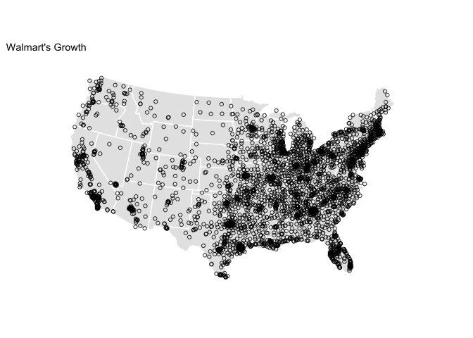
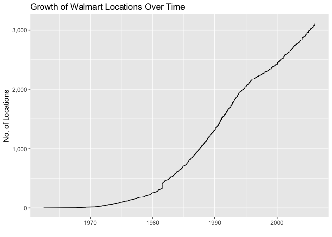
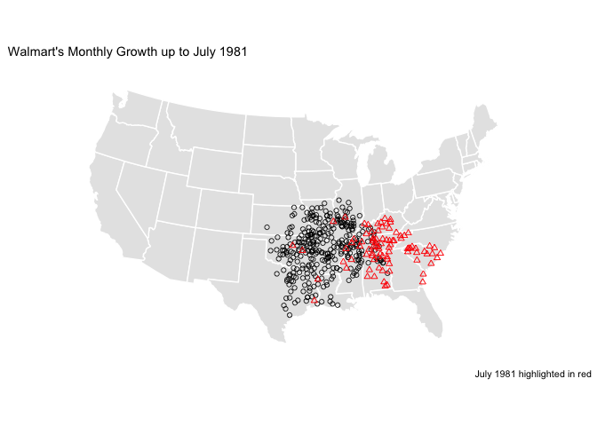
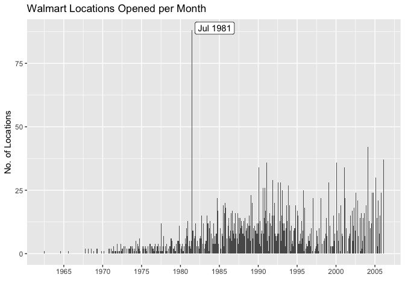

### Summary

Mike Bostock recently posted a D3 visualization of the growth of Walmart locations in the US. I wanted to recreate it in R, animating it with the `gganimate` package, and do a brief investigation.

### Reading in the Data

The original D3 visualization can be found [here](https://beta.observablehq.com/@mbostock/walmarts-growth), and the original data he used comes from [here](http://users.econ.umn.edu/~holmes/data/WalMart/index.html).


```r
library(tidyverse)

data <- "https://gist.githubusercontent.com/mbostock/4330486/raw/fe47cd0f43281cae3283a5b397f8f0118262bf55/walmart.tsv"

walmart <- read_csv2(data) %>%
    separate(col = "0\t1\tdate", into = c("lon", "lat", "estab"), sep = "\t") %>%
    mutate(
        lon = as.numeric(lon),
        lat = as.numeric(lat),
        estab = lubridate::mdy(estab)
    ) %>%
    arrange(estab) %>%
    rowid_to_column("number")
```

### First Plot

After reading in the data, we can make a first plot of all locations with the correct map projection.


```r
library(maps)
library(ggthemes)
states <- map_data("state")

ggplot() +
    geom_polygon(data = states, aes(x = long, y = lat, group = group),
                 fill = "grey90", color = "white") +
    coord_map("albers", lat0 = 39, lat1 = 45) +
    geom_point(data = walmart, aes(x = lon, y = lat), 
               size = 1.5, alpha = 0.8, shape = 1) +
    theme_map() +
    ggtitle("Walmart's Growth")
```



### First Animation

Now that we have a plot that looks quite similar to the final graphic, let's animate it using the `gganimate` package. To plot current points in the animation in red, I just plotted the data twice, in one case setting the aesthetic `cumulative = TRUE` and in the other `cumulative = FALSE`. We can save the output as a gif.


```r
library(animation)
library(gganimate)

wal_ani <- ggplot() +
    geom_polygon(data = states, aes(x = long, y = lat, group = group),
                 fill = "grey90", color = "white") +
    coord_map("albers", lat0 = 39, lat1 = 45) +
    theme_map() +
    # plot first location
    geom_point(data = filter(walmart, number == 1), 
               aes(x = lon, y = lat), color = "blue", size = 1.5) +
    # plot all others
    geom_point(data = filter(walmart, number != 1),
               aes(x = lon, y = lat, frame = estab, cumulative = TRUE), 
               size = 1.5, alpha = 0.8, shape = 1) +
    # plot red point when added
    geom_point(data = filter(walmart, number != 1),
               aes(x = lon, y = lat, frame = estab, cumulative = FALSE), 
               size = 1.5, color = "red") +
    ggtitle("Walmart's Growth")

ani.options(ani.width = 640, ani.height = 480, interval = 0.1)
gganimate(wal_ani, filename = "walmart.gif")
```

<center>


</center>

It is interesting to note the strong clustering of locations near the original establishment in Arkansas. Rather than spreading geographically wide, the approach to expansion definitely seems to favor a more gradual regional growth expanding from the origin.

### Line Plot

A downside of this style of animation is that it can be difficult to discern the pace of the growth. As the plot below shows, it is hardly linear, particularly in the 1980s.


```r
ggplot(walmart, aes(x = estab, y = number)) + 
    geom_line() +
    scale_y_continuous("No. of Locations", labels = scales::comma) +
    scale_x_date("") +
    ggtitle("Growth of Walmart Locations Over Time")
```



### Monthly Growth Animation

I can try to account for this in the animation by rounding dates to the nearest month and adding any empty months to the dataset.


```r
library(lubridate)
walmart <- walmart %>% 
    mutate(rdate = round_date(estab, unit = "month")) 

# join in empty months
walmart_mon <- walmart %>%
    right_join(
        as_tibble(seq(min(walmart$rdate), max(walmart$rdate), by = 'month')),
        by = c("rdate" = "value")
    ) %>%
    mutate(
        lon = ifelse(is.na(lon), 0, lon),
        lat = ifelse(is.na(lat), 0, lat)
        )
```

Now the animation below shows monthly growth, which gives a slightly better impression of the time dimension of the growth.


```r
wal_ani_mon <- ggplot() +
    geom_polygon(data = states, aes(x = long, y = lat, group = group),
                 fill = "grey90", color = "white") +
    coord_map("albers", lat0 = 39, lat1 = 45) +
    theme_map() +
    # plot first location
    geom_point(data = filter(walmart_mon, number == 1), 
               aes(x = lon, y = lat), color = "blue", size = 1.5) +
    # plot all others
    geom_point(data = filter(walmart_mon, number != 1),
               aes(x = lon, y = lat, frame = rdate, cumulative = TRUE), 
               size = 1.5, alpha = 0.8, shape = 1) +
    # plot red point when added
    geom_point(data = filter(walmart_mon, number != 1),
               aes(x = lon, y = lat, frame = rdate, cumulative = FALSE), 
               size = 1.5, color = "red") +
    ggtitle("Walmart's Monthly Growth")

ani.options(ani.width = 640, ani.height = 480, interval = 0.1)
gganimate(wal_ani_mon, filename = "walmart_mon.gif")
```

<center>


</center>

### Investigating High Months

In the monthly animation, you will notice one especially large flash where a substantial number of locations opened in a single month. In the table below, we can see the months with the greatest number of new locations opening.

<!--html_preserve--><div id="htmlwidget-b65be9bbe4096241d10c" style="width:100%;height:auto;" class="datatables html-widget"></div>
<script type="application/json" data-for="htmlwidget-b65be9bbe4096241d10c">{"x":{"filter":"none","data":[["1","2","3","4","5","6","7","8","9","10","11","12","13","14","15","16","17","18","19","20","21","22","23","24","25","26","27","28","29","30","31","32","33","34","35","36","37","38","39","40","41","42","43","44","45","46","47","48","49","50","51","52","53","54","55","56","57","58","59","60","61","62","63","64","65","66","67","68","69","70","71","72","73","74","75","76","77","78","79","80","81","82","83","84","85","86","87","88","89","90","91","92","93","94","95","96","97","98","99","100","101","102","103","104","105","106","107","108","109","110","111","112","113","114","115","116","117","118","119","120","121","122","123","124","125","126","127","128","129","130","131","132","133","134","135","136","137","138","139","140","141","142","143","144","145","146","147","148","149","150","151","152","153","154","155","156","157","158","159","160","161","162","163","164","165","166","167","168","169","170","171","172","173","174","175","176","177","178","179","180","181","182","183","184","185","186","187","188","189","190","191","192","193","194","195","196","197","198","199","200","201","202","203","204","205","206","207","208","209","210","211","212","213","214","215","216","217","218","219","220","221","222","223","224","225","226","227","228","229","230","231","232","233","234","235","236","237","238","239","240","241","242","243","244","245","246","247","248","249","250","251","252","253","254","255","256","257","258","259","260","261","262","263","264","265","266","267","268","269","270","271","272","273","274","275","276","277","278","279","280","281","282","283","284","285","286","287","288","289","290","291","292","293","294","295","296","297","298","299","300","301","302","303","304","305","306","307","308","309","310","311","312","313","314","315","316","317","318","319","320","321","322","323","324","325","326","327","328","329","330","331","332","333","334","335","336","337","338","339","340","341","342","343","344","345","346","347","348","349","350","351","352","353","354","355","356","357","358","359","360"],["Jul 1981","Feb 2004","Feb 2006","Feb 1991","Feb 2000","Feb 1990","Feb 2001","Feb 2005","Nov 1991","Aug 1992","Feb 1999","Nov 1992","Nov 1993","Aug 1990","Nov 1990","Feb 1993","Nov 1995","Aug 2002","Nov 2004","Nov 2005","Sep 2004","Feb 1989","Feb 1997","Feb 1998","Mar 2001","Oct 1984","Jun 2005","Oct 2002","Apr 1989","Feb 1992","Oct 1985","Aug 2000","Jan 1994","Jul 1985","Nov 1994","Nov 2003","Sep 1993","Jan 1996","May 2002","Nov 1985","Dec 1990","Feb 2002","Jan 1995","Nov 1984","Sep 1986","Apr 2003","Feb 1987","Jul 1986","Jul 1991","Jun 2000","May 1987","Sep 1985","Sep 2003","Feb 1995","Jan 1992","Jan 1993","Jun 1983","Nov 1988","Nov 2001","Oct 1982","Oct 1991","Sep 1999","Sep 2005","Apr 2005","Feb 2003","Jul 1987","Jul 2003","Mar 1986","May 1988","Oct 1990","Oct 1998","Sep 1987","Apr 1990","Apr 1991","Apr 2004","Aug 1995","Dec 1980","Mar 1988","Nov 1983","Nov 1987","Oct 1992","Oct 1993","Apr 1984","Aug 1983","Aug 1988","Aug 1991","Aug 2004","Dec 1981","Dec 1982","Dec 1986","Jan 1990","Jan 1991","Jul 1977","Jul 1983","Mar 1993","May 1993","Nov 1989","Apr 1994","Apr 1999","Apr 2002","Dec 1987","Dec 1988","Feb 1986","Jul 1989","Nov 1979","Oct 1988","Sep 1991","Aug 1993","Feb 1985","Jul 1988","Jun 1989","Jun 2004","May 2001","Nov 1996","Nov 1997","Oct 1980","Oct 1983","Oct 1987","Oct 1994","Sep 1994","Apr 1993","Aug 1981","Aug 1989","Aug 1994","Feb 1994","Jul 1990","Jul 1997","Jul 2002","Jun 1986","Jun 1988","Jun 1993","Mar 2000","Oct 1986","Oct 1995","Sep 1981","Sep 1989","Aug 1984","Aug 1987","Aug 2005","Dec 1983","Dec 1989","Feb 1988","Jan 1988","Jul 1992","Jun 1990","Jun 1995","Mar 1987","Mar 1992","May 1985","Nov 1986","Nov 1999","Oct 1989","Oct 2000","Oct 2001","Sep 1984","Sep 1990","Sep 1992","Sep 1996","Sep 1998","Apr 1986","Apr 1988","Apr 1992","Aug 1982","Aug 1997","Jun 1984","Jun 1985","Jun 1991","Jun 1992","Jun 1996","Nov 1977","Nov 1980","Nov 1981","Nov 1998","Nov 2000","Nov 2002","Oct 2003","Sep 2001","Apr 1987","Aug 1980","Aug 2001","Feb 1984","Jan 1986","Jan 1987","Jul 1982","Jul 1998","May 1986","May 1989","Nov 1978","Oct 1974","Oct 1978","Oct 1981","Sep 1982","Sep 1988","Sep 1995","Apr 1974","Apr 1983","Aug 1979","Aug 1986","Aug 1996","Dec 1978","Dec 1992","Jan 1989","Jul 1996","Jun 1981","Jun 1994","Jun 1998","Jun 2003","Mar 1981","Mar 1982","Mar 1991","Mar 2002","May 1983","May 1992","May 1995","May 2000","Oct 1979","Oct 1999","Sep 1979","Apr 1978","Apr 1980","Apr 1995","Apr 1998","Dec 1979","Dec 1984","Feb 1976","Jul 1974","Jul 1979","Jul 1984","Jul 1995","Jun 1987","Mar 1976","Mar 1977","Mar 1983","Mar 1984","Mar 1990","Mar 1995","Mar 1996","May 1972","May 1984","May 1994","Nov 1971","Nov 1982","Oct 1976","Sep 1980","Sep 1997","Apr 1975","Apr 1976","Apr 1979","Apr 1981","Apr 1996","Aug 1973","Aug 1974","Aug 1978","Aug 1985","Aug 1999","Feb 1975","Feb 1977","Feb 1978","Feb 1981","Feb 1982","Jan 1977","Jul 1975","Jul 1980","Jul 1993","Jul 1994","Jul 1999","Jun 1971","Jun 1997","Jun 1999","Mar 1980","May 1976","May 1977","May 1982","May 1990","May 1996","May 1999","May 2005","Nov 1972","Nov 1973","Nov 1975","Oct 1972","Oct 1977","Oct 1996","Sep 1973","Sep 1976","Sep 1978","Apr 1969","Aug 1972","Aug 1975","Dec 1973","Feb 1971","Feb 1973","Feb 1974","Feb 1979","Feb 1980","Feb 1983","Feb 1996","Jul 1968","Jul 1972","Jul 1973","Jul 1976","Jun 1973","Jun 1975","Jun 1976","Jun 1978","Jun 1982","Mar 1968","Mar 1975","Mar 1979","Mar 1985","May 1969","May 1973","May 1981","May 1997","May 2003","Nov 1970","Oct 1967","Oct 1970","Sep 1974","Apr 1971","Apr 1977","Apr 1997","Aug 1964","Aug 1965","Aug 1971","Aug 1976","Aug 1977","Dec 1971","Dec 1976","Dec 1995","Feb 1972","Jan 1974","Jan 1997","Jul 1962","Jul 2000","Jul 2001","Jun 1972","Jun 1977","Jun 1979","Jun 1980","Mar 1970","Mar 1972","Mar 1978","Mar 1994","Mar 2003","May 1971","May 1974","May 1978","May 1979","May 1980","May 1991","Nov 1968","Nov 1969","Nov 1974","Oct 1971","Oct 1997","Sep 1971","Sep 1975","Sep 1977","Sep 1983"],[88,42,37,36,36,34,34,30,29,28,28,28,27,26,26,25,25,24,24,24,24,23,22,22,22,22,21,21,20,20,20,19,19,19,19,19,19,18,18,18,17,17,17,17,17,16,16,16,16,16,16,16,16,15,15,15,15,15,15,15,15,15,15,14,14,14,14,14,14,14,14,14,13,13,13,13,13,13,13,13,13,13,12,12,12,12,12,12,12,12,12,12,12,12,12,12,12,11,11,11,11,11,11,11,11,11,11,10,10,10,10,10,10,10,10,10,10,10,10,10,9,9,9,9,9,9,9,9,9,9,9,9,9,9,9,9,8,8,8,8,8,8,8,8,8,8,8,8,8,8,8,8,8,8,8,8,8,8,8,7,7,7,7,7,7,7,7,7,7,7,7,7,7,7,7,7,7,6,6,6,6,6,6,6,6,6,6,6,6,6,6,6,6,6,5,5,5,5,5,5,5,5,5,5,5,5,5,5,5,5,5,5,5,5,5,5,5,5,4,4,4,4,4,4,4,4,4,4,4,4,4,4,4,4,4,4,4,4,4,4,4,4,4,4,4,3,3,3,3,3,3,3,3,3,3,3,3,3,3,3,3,3,3,3,3,3,3,3,3,3,3,3,3,3,3,3,3,3,3,3,3,3,3,3,3,3,2,2,2,2,2,2,2,2,2,2,2,2,2,2,2,2,2,2,2,2,2,2,2,2,2,2,2,2,2,2,2,2,2,1,1,1,1,1,1,1,1,1,1,1,1,1,1,1,1,1,1,1,1,1,1,1,1,1,1,1,1,1,1,1,1,1,1,1,1,1,1,1,1,1]],"container":"<table class=\"display\">\n  <thead>\n    <tr>\n      <th> <\/th>\n      <th>Date<\/th>\n      <th>Locations Opened<\/th>\n    <\/tr>\n  <\/thead>\n<\/table>","options":{"pageLength":5,"lengthMenu":[5,10,15,20],"columnDefs":[{"className":"dt-body-center","targets":"_all"},{"className":"dt-head-center","targets":"_all"},{"className":"dt-right","targets":2},{"orderable":false,"targets":0}],"order":[],"autoWidth":false,"orderClasses":false}},"evals":[],"jsHooks":[]}</script><!--/html_preserve-->

Did 88 new Walmarts open in July 1981 alone? If we plot Walmart's growth up to this point, and mark these locations in red, we can see that this month would have been a really big month for the company, particularly making inroads east of Arkansas. 


```r
ggplot() +
    geom_polygon(data = states, aes(x = long, y = lat, group = group),
                 fill = "grey90", color = "white") +
    coord_map("albers", lat0 = 39, lat1 = 45) +
    geom_point(data = filter(walmart, rdate < as.Date("1981-07-01")), 
               aes(x = lon, y = lat), 
               size = 1.5, alpha = 0.8, shape = 1) +
    geom_point(data = filter(walmart, rdate == as.Date("1981-07-01")), 
               aes(x = lon, y = lat), 
               size = 1.5, color = "red", shape = 2) +
    theme_map() +
    labs(title = "Walmart's Monthly Growth up to July 1981", 
         caption = "July 1981 highlighted in red")
```



However, more realistically, this is likely an error in the data. As seen in the plot below, it is such a huge outlier (more than double the next highest month) that a simple error seems to be the most likely explanation.


```r
mon_counts <- walmart %>%
    count(rdate) 

mon_counts %>%
    ggplot(aes(x = rdate, y = n)) + 
    geom_col() +
    scale_y_continuous("No. of Locations") +
    scale_x_date("", breaks = seq(as.Date("1965-01-01"), as.Date("2005-01-01"), by = "5 years"), labels = scales::date_format("%Y")) +
    ggrepel::geom_label_repel(
        data = filter(mon_counts, rdate == as.Date("1981-07-01")),
        aes(label = format(rdate, "%b %Y"))
    ) +
    ggtitle("Walmart Locations Opened per Month")
```


